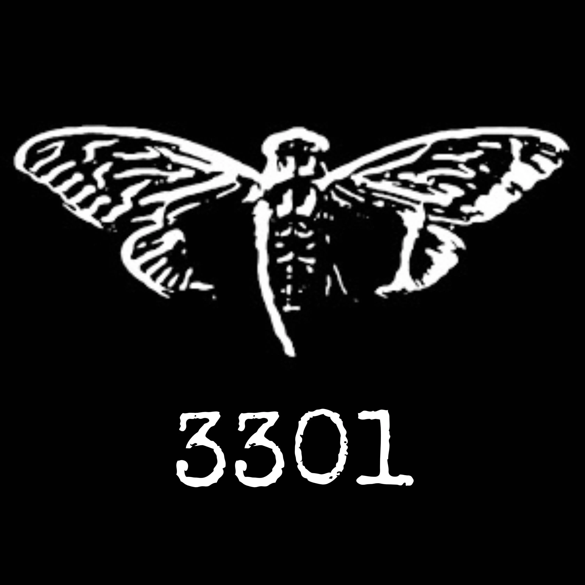

# ☢️ Cicada 3301 — Puzzle Web Interativo

> Puzzle web interativo inspirado no famoso enigma Cicada 3301. Cinco fases, cada uma com uma técnica diferente de criptografia e investigação. No final, um certificado personalizado em PDF.


Demo ao vivo → [pedroaruana.pythonanywhere.com](https://pedroaruana.pythonanywhere.com)



## 📖 Sobre

Sempre fui fascinado pelo mistério do Cicada 3301. Em 2012, alguém (ou algum grupo) publicou um dos enigmas mais complexos da internet — e até hoje ninguém sabe quem estava por trás. Decidi criar minha própria versão como forma de homenagem e desafio pessoal.

O jogo é composto por **5 fases**, cada uma exigindo uma técnica diferente para encontrar o link da próxima. Desde criptografia até análise de imagem. No final, o jogador recebe um certificado personalizado em PDF.

## 🛠️ Stack

- **Backend:** Python, Flask, Gunicorn
- **Frontend:** HTML5, CSS3, JavaScript
- **Esteganografia:** Pillow (LSB encoding)
- **PDF:** jsPDF + html2canvas
- **Testes:** pytest (24 testes automatizados)
- **CI/CD:** GitHub Actions
- **Container:** Docker
- **Deploy:** PythonAnywhere

## 📁 Arquitetura

```
├── app.py                  # rotas Flask
├── templates/              # páginas Jinja2 (fases, certificado, etc.)
├── static/
│   ├── css/style.css       # estilos globais
│   ├── js/tracker.js       # timer e contador por fase
│   └── img/                # imagens do projeto
├── tests/
│   └── test_routes.py      # 24 testes automatizados
├── Dockerfile              # containerização
├── .github/workflows/
│   └── ci.yml              # pipeline CI (testes + build Docker)
└── requirements.txt
```

## 🚀 Rodando local

```bash
pip install -r requirements.txt
python app.py
```

Acesse `http://localhost:5000`

## 🧪 Testes

```bash
python -m pytest tests/ -v
```

## 🐳 Docker

```bash
docker build -t cicada-3301 .
docker run -p 5000:5000 cicada-3301
```

## 🧩 Dificuldades

A parte mais difícil foi montar os desafios de forma que cada fase tivesse uma técnica realmente diferente e que fizesse sentido na progressão. A esteganografia LSB levou bastante pesquisa pra implementar do zero com Pillow — esconder dados nos bits menos significativos de cada pixel sem alterar visivelmente a imagem não é trivial.

O rastreamento de IP na página confidencial também deu trabalho. Em produção, o IP real do visitante vem no header `X-Forwarded-For` por causa do proxy reverso do PythonAnywhere — se eu pegasse só o `request.remote_addr` ia mostrar o IP do servidor, não do usuário. Além disso, cruzar o IP com dados do navegador via JavaScript (user agent, resolução, fuso horário) pra montar aquele efeito de "estamos te observando" exigiu cuidado pra funcionar consistente em diferentes browsers.

Equilibrar a dificuldade das fases foi outro desafio. Fácil demais e a pessoa resolve em 2 minutos, difícil demais e desiste. O sistema de dicas com o botão `?` em cada fase foi a solução — dá um empurrão sem entregar a resposta.

## 👨‍💻 Autor

**Pedro Aruanã**

- [Portfólio](https://portifiolio-pedro.vercel.app)
- [GitHub](https://github.com/Pedroaruana)
- [LinkedIn](https://www.linkedin.com/in/pedro-aruan%C3%A3/)

## 📄 Licença

Distribuído sob a licença MIT. Veja o arquivo [LICENSE](LICENSE) para mais detalhes.
